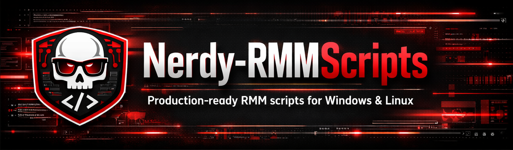

**129+ scripts** for Any RMM for agents on Windows & Linux. Organized by category, professionally named, production-ready.

## 📂 Folder Structure

### Windows
- **PowerShell:** Audit, Checks, Collect, Maintain, Security, Network, TRMM Agent, Wazuh Agent, Apps, AV, Quick Fixes
- **Batch:** Common admin tasks [View](Windows/Batch/)

### Linux (12 categories)
Audit, Collector Tasks, Crontab, Customization, Maintenance, Monitoring, Network, OS Scripts, Security, Software Management, TRMM Agent, Wazuh Agent

[View all categories](Linux/)

## 🚀 Quick Start

1. **Navigate:** `Windows/Powershell/` or `Linux/<Category>/`
2. **Download:** Choose your script
3. **Import to TacticalRMM:** Scripts → Import Script → Browse

## 📋 Script Format

All scripts follow: `<Category> - <Descriptive Title>.<ext>`

**Examples:** `Monitor - CPU Usage.sh`, `Check - Domain Connection.ps1`

**Categories:** Check, Monitor, Audit, Collect, Agent, Software Management, Security, Maintain, Network, Customize, Cron, Image

See [NAMING-CONVENTION.md](NAMING-CONVENTION.md) for details.

## 📚 Documentation

- [Linux README](Linux/README.md) - Linux scripts overview
- [Batch README](Windows/Batch/README.md) - Batch scripts guide  
- [Naming Convention](NAMING-CONVENTION.md) - Complete standards
- Category READMEs - Detailed script listings in each folder

## 🤝 Contributing

1. Follow naming: `<Category> - <Descriptive Title>.ext`
2. Place in appropriate folder
3. Update folder README
4. Test thoroughly
5. Submit PR

## 📄 License & Disclaimer

Licensed under [MIT License](LICENSE). Scripts provided as-is. **Always test in non-production environments first.** No liability for damages.

## 🔗 Links

- [TacticalRMM Repo](https://github.com/amidaware/tacticalrmm)
- [TacticalRMM Docs](https://docs.tacticalrmm.com/)

---

**Repository:** [Nerdy-Technician/Nerdy-RMMScripts](https://github.com/Nerdy-Technician/Nerdy-RMMScripts)
